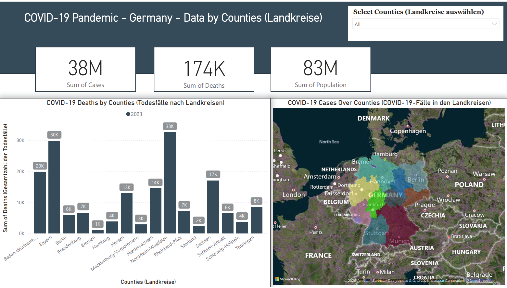

# 🦠 COVID-19 Pandemic in Germany – Power BI Report by Counties (Landkreise)

This project presents an interactive **Power BI Report** analyzing the **COVID-19 pandemic's impact** across Germany at the **county (Landkreise)** level. It visualizes confirmed cases, deaths, and population distributions using official dataset sources.

